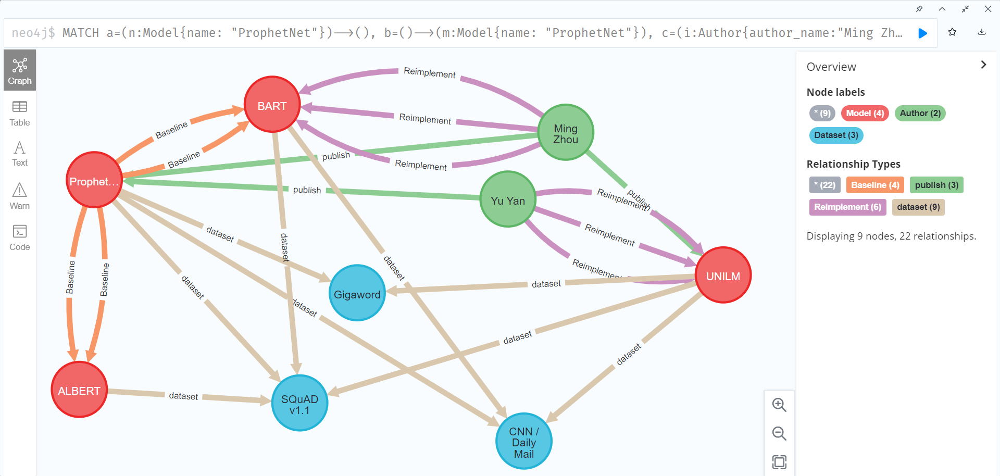
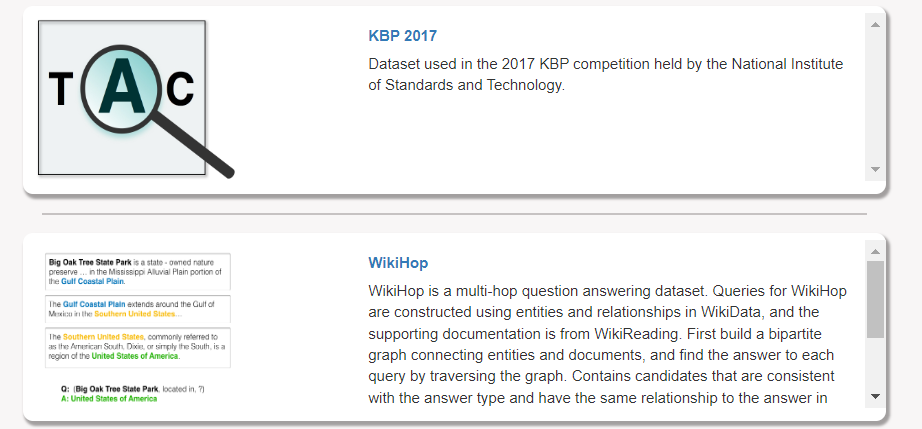
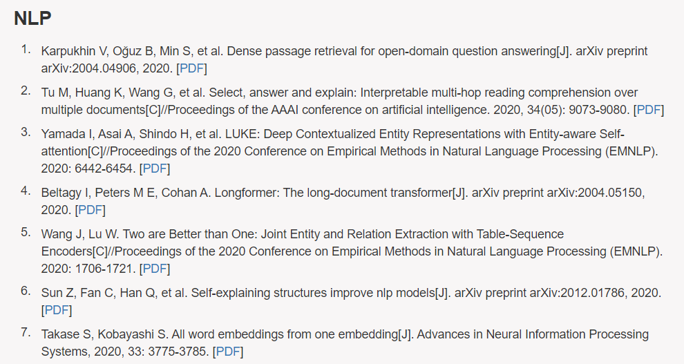

# 0 Neo4j数据库结构



本文件主要做文件命名规则的说明以及各个`yaml`文件中数据格式的补充说明

具体`yaml`数据格式请参考示例中的注释

>该命名规则以及数据格式由个人定义，难免有设计不当及考虑不周之处。

# 1 命名规则

主要包括3类文件：数据集文件， 论文文件， 复现信息文件

## 1.1 保存文件名命名规则

为保证存储yaml文件时发生异常，对存储文件名做以下规定

### 1.1.1 特殊符号替换规则

- `/ \ : |` ，使用减号 `-` 代替
- `? > < "` ，直接忽略
- 原名中的下划线 `_` 使用减号 `-` 代替
- 文件命名时所有空格使用`-`代替，存在多个连续`-`时使用单个`-`代替

### 1.1.2 数据集信息文件

**命名格式：** `d_[数据集名称]_[上传者名称（多个上传者仅保留第一个名称）]_[上传时间（年）].yaml` 

例如 `CNN-Daily-Mail_Karl-Moritz-Hermann_2018`

- 数据集 `CNN / Daily Mail` 在命名时记为 `CNN-Daily-Mail` 
- 上传者名称之间 `-` 代替空格
- 上传时间使用数字表示，如 2018

### 1.1.3 论文信息文件

**命名格式：** `p_[论文名称]_[会议/期刊缩写（全部大写）]_[发表时间（年）].yaml` 

如 `p_Learning-to-Extract-Coherent-Summary-via-Deep-Reinforcement-Learning_AAAI_2018` 

其中论文名称对应该论文PDF文件中的论文名称，严格区分大小写

### 1.1.4复现信息文件

**命名格式：** `r_[论文名称]_[上传者名称（多个上传者仅保留第一个名称）]_[更新时间（年）].yaml` 

论文名称与上传者名称格式与上文规定相同


## 1.2 论文题目信息

以该论文文件中论文标题为准，严格区分大小写


## 1.3 作者名称

以论文文件中论文题目下方的格式为准，中文姓后名前，如张三记为 San Zhang


# 2 yaml文件内容格式

**文件一律使用utf-8编码格式，各字段内容使用英文填写**

**yaml文件内容中不可出现Tab符号**


## 2.1 缩进格式

所有文件为`yaml`文件，缩进时不允许使用Tab键，只允许使用空格。


## 2.2 内容格式

**具体文件内容格式见 `yaml` 文件样例中的注释信息，若找不到对应字段的内容 / 缺失信息，则对应位置为空即可**

需要参考的模板文件：
- `d_CNN-Daily-Mail_Karl-Moritz-Hermann_2018.yaml` 对于数据集的描述文件
- `p_Learning-to-Extract-Coherent-Summary-via-Deep-Reinforcement-Learning_AAAI_2018.yaml` 对于论文的描述文件
- `r_Learning-to-Extract-Coherent-Summary-via-Deep-Reinforcement-Learning_San-Zhang_2019.yaml` 对于复现模型结果的描述文件

### 2.2.1 performance中多级metrics格式

存在多级metric（如同一数据集下不同的实验设置），则在 `[dataset_name]`后依次分级即可，程序可自动识别。需要遵循 yaml文件的缩进格式

```yaml
dataset_name:
  Setup1:
    sub-setup1:
  	  detailed-setup:
  	  	metric-name:"123.123"
```

### 2.2.2 数据集描述文件补充说明

- 尽可能为每个数据集增加一个 logo 图片，最终需要如下图的数据集展示页面，左侧为数据集对应的logo，右侧为数据集描述信息。
- `logo_file` 信息，对应内容是该数据集的**logo图片存储文件名称**（统一放在DatasetLogos文件夹下），如果没有找到数据集对应的logo图片，则该字段为空。



### 2.2.3 论文/模型描述文件补充说明

- `organization` 信息，作者属于多个不同机构时，多个机构名用','隔开
- `baseline` 信息，需要区分不同baseline在不同数据集上的表现，具体要求请参照模板信息。 
- `abstract` 信息，对应内容是论文的摘要/模型的描述信息。如果原论文/模型不存在摘要或描述，则需要自己添加对于论文、模型的描述信息。
- `citation_string` 信息，对应内容是该论文、模型的引用格式。可以直接在Google Scholar上复制对应的 GB/T 7714 格式。最终需要在论文/模型信息展示页面列出的信息如下图所示



